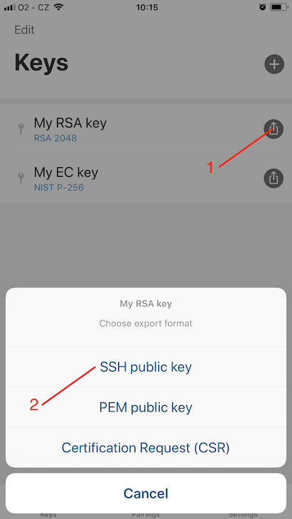
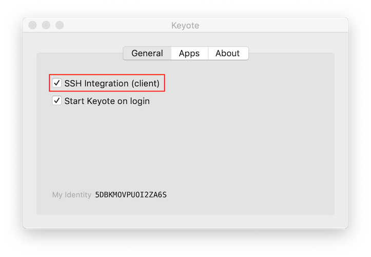

OpenSSH client and Keyote
=========================

Keyote can be used as a security token for OpenSSH.
It means that the user needs to authorize access to a remote server using his/her smartphone and its biometry.
The integration takes place entirely on the client side,
there is no software you need to add to an SSH server.

It means that you don't have to use passwords for accessing the SSH server
nor have private keys stored on the drive of the computer.
Keys are securely stored in the smartphone security chip and their use has to be confirmed by biometry of a user.
It means that no-one can steal/copy your keys to the server and misuse them.
You always know where your keys are.

Keyote can be used to authenticate access for SSH, SCP, SFTP, GIT, and other SSH-based protocols.


Authorized keys
---------------

The `authorized_keys` file specifies the SSH public keys that can be used for logging into the user account on the server for which the file is configured. The default configuration in most SSH servers allows you to deploy new authorized public keys. 

What you need to do, is to open Keyote app on the mobile phone and export **RSA** public key in SSH public key format.


  
_Keyote for iOS_


Then store exported SSH public key on the server at `~/.ssh/authorized_keys`. If `.ssh` directory or `authorized_keys` file do not exists, create them.


Automated integration
---------------------

Keyote takes care about the integration with your OpenSSH client automatically.
If you prefer to configure OpenSSH on your own, unselect the configuration option and proceed to the next chapter.




Manual integration
------------------

You can invoke OpenSSH with Keyote authentication from a command-line via `-I` option:  
`ssh -I /usr/local/lib/keyotepkcs11.so username@server`

To ensure permanent integration of the Keyote, adjust your OpenSSH configuration at `~/.ssh/config`.  
Add a following line to the top of the file:  
```
SmartcardDevice "/usr/local/lib/keyotepkcs11.so"
```


Integration with ssh-agent
--------------------------

**INSANE DIFFICULTY**: we work hard to simplify this procedure for you.

We will first use `openssl` with its _pkcs11 engine_ to generate the self-signed certificate,
and secondly `pkcs11-tool` to load the fresh self-signed certificate into Keyote app.

Make sure that the Keyote is running at your phone in the foreground and it is paired with your computer.

```
$ openssl
OpenSSL> engine -t dynamic -pre SO_PATH:/opt/openssl/lib/engines/pkcs11.dylib -pre ID:pkcs11 -pre LIST_ADD:1 -pre LOAD -pre MODULE_PATH:/usr/local/lib/keyotepkcs11.so
OpenSSL> req -engine pkcs11 -new -key pkcs11:object=My%20RSA%20key -keyform engine -x509 -out cert.der -outform DER -subj "/CN=MyCert"
OpenSSL> exit

$ pkcs11-tool --module src/usr/local/lib/keyotepkcs11.so -w cert.der -y cert
```

From now on, you can use `ssh-add` to add Keyote keys to your `ssh-agent`.

```
$ ssh-add -s /usr/local/lib/keyotepkcs11.so
```

_The `ssh-add` will ask for a passphrase, just press ENTER._
